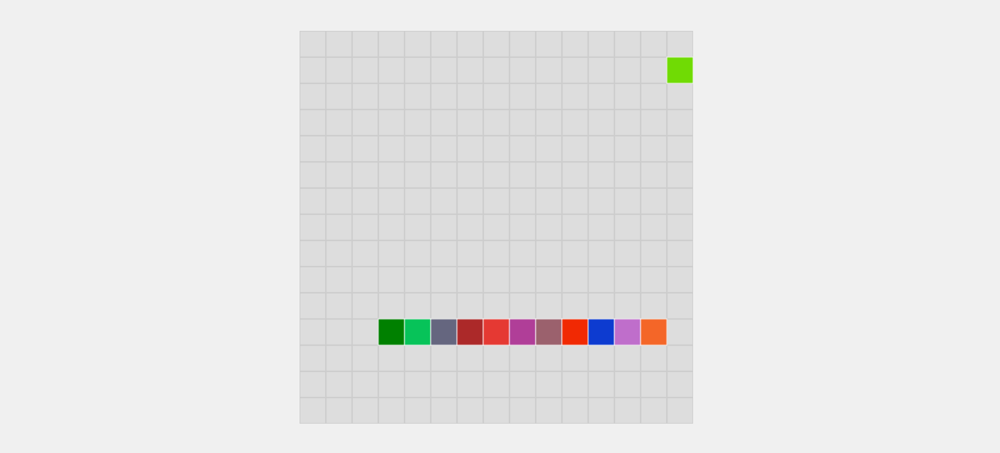

# 🐍 Snake Game 🍎

## Description

Welcome to the classic Snake Game implemented in JavaScript! Control the snake, represented by a colorful block, and navigate it around the game board to eat random coloured food blocks. As the snake eats the food, it grows longer, and the color of the food block is appended to its tail.

## Demo

You can play the live demo of the game [here](https://your-demo-link).

## Features

- Classic Snake gameplay with a colorful twist.
- Randomly generated food blocks for endless fun.
- Responsive controls for smooth snake movement.
- Score tracking to keep you motivated.

## How to Play

1. Clone this repository or download the ZIP file.
2. Open the `index.html` file in your web browser.
3. Use arrow keys (UP, DOWN, LEFT, RIGHT) to control the snake's direction.
4. Try to eat as much food as you can without colliding with the walls or the snake's own tail.

## Screenshots

## Technologies Used

- HTML
- CSS
- JavaScript

## Contributions

Contributions are welcome! If you find any bugs or have suggestions for improvements, please feel free to open an issue or submit a pull request.

## License

This project is licensed under the MIT License - see the [LICENSE](LICENSE) file for details.

## Acknowledgments

- Special thanks to the JavaScript community for the awesome language.
- Thanks to the open-source libraries and frameworks used in this project, which accelerated development.
- Appreciation to the online tutorials and resources that helped in learning and implementing game mechanics.
- Thanks to the supportive developer communities on platforms like Stack Overflow for answering questions and offering guidance.
- A shout-out to anyone who takes the time to play and enjoy this humble Snake Game 🐍.

Let's play the 🐍 Snake Game 🍎 and have fun!
